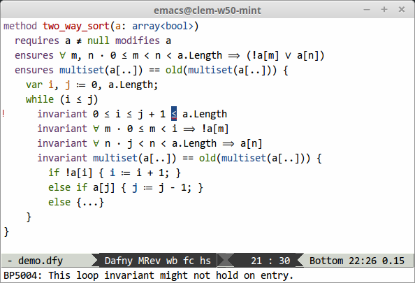
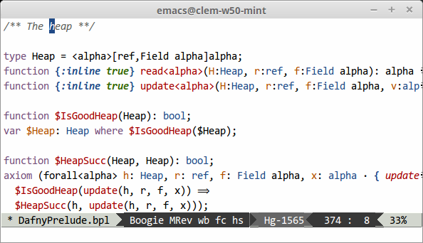

# Boogie friends

A collection of tools for interacting with Boogie and related languages.

## Emacs package (`boogie-mode`, `dafny-mode`)

The `boogie-friends` package is an experimental collection of Emacs modes for
writing verified programs in languages of the Boogie family. Dafny and Boogie
are the two currently supported languages. Features include:

* Syntax highlighting
* Real-time compilation (using `flycheck`)
* Completion (using `company`)
* Code folding (using `hideshow`)
* Prettification (using `prettify-symbols-mode`)

In addition, the Dafny mode offers:

* (A few) Snippets (using `yasnippet`)
* (Some) In-Emacs documentation
* (Experimental) Navigation between Dafny and Boogie source files
* (Some support for) indentation
* (Some support for) jumping to a definition

### Some pictures:

#### A Dafny buffer



Notice the error highlighting, the symbol beautification (`forall` appears as `∀`), and the code folding on the last line!

#### A Boogie buffer



#### Completion and snippets


#### Documentation (Dafny only)


#### Browsing the Boogie translation of a Dafny file


### Setup

#### Automatic

1. Setup [MELPA](http://melpa.org/#/getting-started)

    In your `.emacs`, add these three lines if you don't have them yet:

    ```elisp
    (require 'package) ;; You might already have this line
    (add-to-list 'package-archives '("melpa" . "http://melpa.org/packages/") t)
    (package-initialize) ;; You might already have this line
    ```

2. Indicate the paths to your Dafny and Boogie installations:

    ```elisp
    (defun setup-boogie-friends ()
      (setq flycheck-dafny-executable "PATH-TO-DAFNY")
      (setq flycheck-boogie-executable "PATH-TO-BOOGIE"))

    (add-hook 'boogie-friends-hook #'setup-boogie-friends)
    ```

### Tips

* Completion, indentation, snippets and syntax coloring should work out of the box.
* Real-time error highlighting is enabled by default. You can disable it by adding
  (add `(flycheck-mode -1)` before the last parens of `setup-boogie-friends` above to disable it).

### Keybindings

#### Dafny mode

<kbd>TAB</kbd> auto-indents.
<kbd>C-c C-?</kbd> opens the Dafny docs.
<kbd>&lt;C-down-mouse-1></kbd> looks for the definition of the function under point in open buffers.
<kbd>C-c C-a</kbd> translates the current file to Boogie and shows the translated file.
<kbd>C-c C-j</kbd> or <kbd>C-S-down-mouse-1</kbd> (aka <kbd>Ctrl-Shift-Click</kbd>) jumps to the closest matching location int the Boogie buffer.

After inserting a snippet, <kbd>TAB</kbd> and <kbd>S-TAB</kbd> navigate the fields, and <kbd>C-d</kbd> removes the current field entirely. During completion, <kbd>C-h</kbd> shows documentation for the current snippet, if available.

#### All modes

<kbd>S-TAB</kbd> (aka <kbd>%lt;backtab></kbd> aka <kbd>Shift-Tab</kbd>) manually cycles through reasonable indentation levels
<kbd>C-c C-c</kbd> re-verifies the current file.

### Acknowledgments

The documentation that ships with this package is auto-generated from the [Dafny Quick Reference](http://research.microsoft.com/en-us/projects/dafny/reference.aspx).

### Pull requests are welcome!

Clone the repo:

```bash
mkdir -p ~/.emacs.d/lisp/ && cd ~/.emacs.d/lisp/
git clone https://github.com/boogie-org/boogie-friends
```

Then in your .emacs (in addition to the stuff above):

```elisp
(add-to-list 'load-path "~/.emacs.d/lisp/boogie-friends/emacs/")
(require 'dafny-mode)
(require 'boogie-mode)
```
